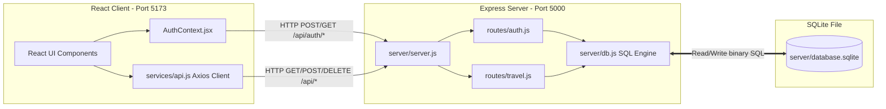
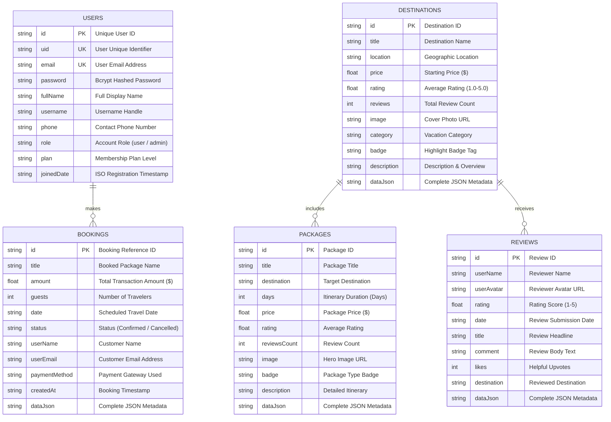

# WanderLuxe Travel Application — Comprehensive Project Documentation

This document provides an elaborate, comprehensive architectural guide for the **WanderLuxe Travel Web Application** (`travel_susmita`). It details the complete project folder structure, page/view mappings, database connectivity layer, and the SQLite3 relational database architecture with an Entity-Relationship (ER) Diagram.

---

## 1. Complete Project Folder & File Structure

```text
e:\mini project\travel_susmita\
├── server/                              # Node.js + Express + SQLite3 Backend API Server
│   ├── database.sqlite                  # SQLite3 relational database file (created on boot)
│   ├── db.js                            # SQLite3 connection engine, table schemas, & auto-seeder
│   ├── server.js                        # Express server entry point (runs on port 5000)
│   └── routes/
│       ├── auth.js                      # Custom JWT & Bcrypt authentication API routes
│       └── travel.js                    # CRUD REST API routes for travel data & bookings
├── src/                                 # React + Vite Frontend Client Source Code
│   ├── App.jsx                          # Root router, global layout & provider wrappers
│   ├── main.jsx                         # React DOM entry point
│   ├── index.css                        # Tailwind CSS imports & custom utility tokens
│   ├── components/                      # Reusable UI Components
│   ├── contexts/                        # React Context State Managers
│   │   ├── AuthContext.jsx              # Frontend Auth state & SQLite3 API connectivity
│   │   ├── ThemeContext.jsx             # Dark/Light theme mode manager
│   │   ├── CurrencyContext.jsx          # Multi-currency conversion switcher
│   │   ├── WishlistContext.jsx          # Saved favorite packages manager
│   │   └── NotificationContext.jsx      # System notification dispatcher
│   ├── pages/                           # Application Pages & Route Views (Detailed below)
│   └── services/
│       ├── api.js                       # Axios HTTP Client connecting UI to SQLite3 backend
│       └── mockData.js                  # Initial travel catalog data & offline fallback
├── public/                              # Static public assets
├── .env                                 # Environment configuration (VITE_API_URL)
├── package.json                         # Project dependencies & concurrently scripts
└── vite.config.js                       # Vite bundler configuration
```

---

## 2. Page & File Mapping Table

Every route in the application is managed by [src/App.jsx](file:///e:/mini%20project/travel_susmita/src/App.jsx) and maps directly to a specialized page file inside `src/pages/`:

| Route Path | Page File | Description & Functionality | Access Level |
| :--- | :--- | :--- | :--- |
| `/` | [Home.jsx](file:///e:/mini%20project/travel_susmita/src/pages/Home.jsx) | **Landing Page**: Features the dynamic hero search bar, curated top destinations, luxury packages showcase, customer reviews, and newsletter signup. | Public |
| `/destinations` | [Destinations.jsx](file:///e:/mini%20project/travel_susmita/src/pages/Destinations.jsx) | **Destinations Catalog**: Browse all available global destinations with category filters (Beach, Honeymoon, Hill Station, Luxury) and interactive cards. | Public |
| `/destinations/:id` | [DestinationDetail.jsx](file:///e:/mini%20project/travel_susmita/src/pages/DestinationDetail.jsx) | **Destination Details**: Deep-dive page showing location highlights, weather summary, map coordinates, and associated packages. | Public |
| `/packages` | [Packages.jsx](file:///e:/mini%20project/travel_susmita/src/pages/Packages.jsx) | **Packages Directory**: Curated travel itineraries with pricing, duration, and rating tags. | Public |
| `/packages/:id` | [PackageDetail.jsx](file:///e:/mini%20project/travel_susmita/src/pages/PackageDetail.jsx) | **Package Itinerary & Booking**: Comprehensive day-by-day travel itinerary, inclusions, exclusions, and instant booking modal. | Public |
| `/hotels` | [Hotels.jsx](file:///e:/mini%20project/travel_susmita/src/pages/Hotels.jsx) | **Luxury Hotels Directory**: Hand-picked 5-star partner resorts, private villas, and cliffside suites. | Public |
| `/transportation` | [Transportation.jsx](file:///e:/mini%20project/travel_susmita/src/pages/Transportation.jsx) | **VIP Transit Options**: First-class flights, bullet train passes, executive limousine rentals, and airport transfers. | Public |
| `/gallery` | [Gallery.jsx](file:///e:/mini%20project/travel_susmita/src/pages/Gallery.jsx) | **Travel Photography Gallery**: High-resolution travel photography grid from Bali, Santorini, Kyoto, and the Swiss Alps. | Public |
| `/about` | [About.jsx](file:///e:/mini%20project/travel_susmita/src/pages/About.jsx) | **About WanderLuxe**: Brand history, luxury concierge philosophy, executive team, and global travel awards. | Public |
| `/contact` | [Contact.jsx](file:///e:/mini%20project/travel_susmita/src/pages/Contact.jsx) | **Customer Concierge**: Direct contact form, 24/7 VIP hotline, and global regional office addresses. | Public |
| `/login` | [Login.jsx](file:///e:/mini%20project/travel_susmita/src/pages/Login.jsx) | **Sign In Portal**: Secure email/password login backed by SQLite3. Includes one-click Auto-Fill buttons for Master Admin and Demo Traveler accounts. | Public |
| `/signup` | [Signup.jsx](file:///e:/mini%20project/travel_susmita/src/pages/Signup.jsx) | **VIP Registration**: Account creation form verifying and storing hashed user credentials in SQLite3. | Public |
| `/forgot-password` | [ForgotPassword.jsx](file:///e:/mini%20project/travel_susmita/src/pages/ForgotPassword.jsx) | **Password Recovery**: Account recovery assistant interface. | Public |
| `/dashboard` | [Dashboard.jsx](file:///e:/mini%20project/travel_susmita/src/pages/Dashboard.jsx) | **Traveler Portal**: Authenticated user dashboard displaying confirmed bookings, saved wishlists, and travel loyalty status. | Protected (User) |
| `/admin` | [AdminDashboard.jsx](file:///e:/mini%20project/travel_susmita/src/pages/AdminDashboard.jsx) | **Master Admin Panel**: Executive management console (`admin@gmail.com`) to manage customer bookings, add/edit/delete destinations and packages, and monitor system health. | Protected (Admin Only) |

---

## 3. Database Connectivity & API Architecture

The application operates on a clean client-server architecture where the frontend React application communicates with the local Express + SQLite3 server via RESTful HTTP APIs.



### Key Files Containing Database Connectivity:

1. **[server/db.js](file:///e:/mini%20project/travel_susmita/server/db.js) — SQLite3 Database Engine & Schema Manager**
   - **Role**: Core database connectivity file on the backend.
   - **Technology**: Uses `sql.js` (WebAssembly SQLite engine) to read and write the binary database file `server/database.sqlite`.
   - **Key Functions**:
     - `initDB()`: Connects to or creates `database.sqlite` on disk and executes the `CREATE TABLE IF NOT EXISTS` DDL statements.
     - `runQuery(sql, params)`: Executes parameterized SQL `INSERT`, `UPDATE`, and `DELETE` commands and automatically syncs changes to `database.sqlite`.
     - `selectQuery(sql, params)`: Executes parameterized SQL `SELECT` queries and returns JavaScript objects.
     - `seedInitialData()`: Automatically populates the database with default destinations, packages, reviews, and the Master Admin account on first start.

2. **[server/server.js](file:///e:/mini%20project/travel_susmita/server/server.js) — Express Server Entry Point**
   - **Role**: Starts the HTTP server on port `5000`, enables CORS, initializes `initDB()`, and mounts the API routers (`/api/auth` and `/api`).

3. **[server/routes/auth.js](file:///e:/mini%20project/travel_susmita/server/routes/auth.js) — Database Authentication Controller**
   - **Role**: Connects login and signup endpoints directly to the SQLite3 `users` table.
   - **Key Endpoints**:
     - `POST /api/auth/signup`: Hashes incoming password using `bcryptjs` and executes an `INSERT INTO users` query.
     - `POST /api/auth/login`: Queries `SELECT * FROM users WHERE email = ?`, compares password hashes, and issues a JSON Web Token (`jwt.sign()`).
     - `GET /api/auth/me`: Verifies the JWT and retrieves the user's profile from the SQLite3 database.

4. **[server/routes/travel.js](file:///e:/mini%20project/travel_susmita/server/routes/travel.js) — Travel Data & Booking Controller**
   - **Role**: Connects travel data endpoints (`/api/destinations`, `/api/packages`, `/api/reviews`, `/api/bookings`) to their corresponding SQLite3 tables.

5. **[src/services/api.js](file:///e:/mini%20project/travel_susmita/src/services/api.js) — Frontend Database Client Bridge**
   - **Role**: The frontend Axios client configured with `baseURL: http://localhost:5000/api`.
   - **Interceptors**: Automatically attaches `Authorization: Bearer <token>` from `localStorage` to every API request.
   - **Fault Tolerance**: Implements seamless offline fallback; if the Express server is offline, it falls back to local data without crashing the UI.

6. **[src/contexts/AuthContext.jsx](file:///e:/mini%20project/travel_susmita/src/contexts/AuthContext.jsx) — Frontend Authentication Connector**
   - **Role**: Manages user sessions and dispatches authentication requests (`signup()`, `login()`, `logout()`) to `http://localhost:5000/api/auth/*`.

---

## 4. SQLite3 Relational Database Schema & ER Diagram

The database uses a 5-table relational schema designed for high performance and clean data integrity.



### Table Schema Breakdown

#### 1. `users` Table
Stores all registered VIP travelers and Master Admin accounts.
- **Master Admin Seed**: Automatically seeded with `email: admin@gmail.com` / `password: admin@123` / `role: admin`.

#### 2. `destinations` Table
Stores travel destinations worldwide (Bali, Santorini, Kyoto, Swiss Alps, Maldives, Amalfi Coast).

#### 3. `packages` Table
Stores curated itineraries with inclusions, exclusions, and day-by-day tour activities.

#### 4. `reviews` Table
Stores verified customer reviews and ratings displayed on destination and package pages.

#### 5. `bookings` Table
Stores all customer reservations placed through the frontend or created by administrators. Accessible by travelers in [Dashboard.jsx](file:///e:/mini%20project/travel_susmita/src/pages/Dashboard.jsx) and by admins in [AdminDashboard.jsx](file:///e:/mini%20project/travel_susmita/src/pages/AdminDashboard.jsx).

---

## 5. How to Run & Verify

To run both the backend Express + SQLite3 server and the frontend Vite React application concurrently with one command:

```powershell
npm run dev
```

- **Frontend Application**: Accessible at `http://localhost:5173`
- **Backend API Server**: Running on `http://localhost:5000/api`
- **Database Health Check**: Visit `http://localhost:5000/api/health`

---

## 6. Project Viva Questions & Answers (40 Comprehensive Q&As)

Below are **40 frequently asked Viva / Defense Questions with detailed answers** structured across 5 core categories to prepare you thoroughly for any external examiner or project evaluation.

---

### Category 1: Project Overview & Architecture (Q1 – Q8)

#### Q1: What is the main objective of the WanderLuxe Travel Application?
**Answer:**
WanderLuxe is a full-stack, premium luxury travel booking web application designed to allow users to explore global travel destinations, view detailed day-by-day travel packages, read verified customer reviews, and book reservations. It also features a dedicated Master Admin console for managing catalogs, bookings, and customer accounts.

#### Q2: What is the complete technology stack used in this project?
**Answer:**
- **Frontend**: React 18, Vite 5, Tailwind CSS, React Router DOM, Lucide Icons, Framer Motion (animations), and Axios (HTTP client).
- **Backend**: Node.js, Express.js (REST API server), JSON Web Tokens (`jsonwebtoken`), and Bcrypt (`bcryptjs`) for password hashing.
- **Database**: SQLite3 relational database managed via `sql.js` (WebAssembly SQLite engine) stored locally in `server/database.sqlite`.

#### Q3: Why did you choose React + Vite for the frontend instead of traditional HTML/JS or Create React App?
**Answer:**
React allows building component-driven, responsive user interfaces with reusable UI elements and reactive state management. **Vite** was chosen over Create React App because it uses native ES modules during development, resulting in near-instant Hot Module Replacement (HMR) and significantly faster build times.

#### Q4: Why did you migrate from Firebase to a local SQLite3 database and Express backend?
**Answer:**
Migrating to a self-contained Express + SQLite3 backend eliminates third-party cloud vendor lock-in, removes external API rate limits or billing requirements, allows running the application 100% locally/offline, and demonstrates strong core competency in relational SQL schema design and RESTful backend architecture.

#### Q5: Explain the architectural pattern used in this project.
**Answer:**
The project follows a **Client-Server RESTful API Architecture**:
1. **Presentation Layer (Frontend)**: React SPA running on port `5173`.
2. **Controller/Service Layer (Backend)**: Express API running on port `5000` handling routing, validation, and security.
3. **Data Persistence Layer**: SQLite3 relational database storing tables on disk (`server/database.sqlite`).

#### Q6: How are the frontend and backend run concurrently during local development?
**Answer:**
Using the `concurrently` package defined in `package.json`. When running `npm run dev`, it simultaneously starts `node server/server.js` (Backend API on port 5000) and `vite` (Frontend dev server on port 5173).

#### Q7: What is the role of `package.json` in this project?
**Answer:**
`package.json` tracks project metadata, dependencies (like `express`, `cors`, `sql.js`, `react-router-dom`), and execution scripts (`dev`, `build`, `server`, `client`).

#### Q8: How does the application handle offline scenarios or backend server interruptions?
**Answer:**
The frontend Axios client (`src/services/api.js`) includes a graceful fallback pattern. If a request to the Express API (`/api/*`) fails due to server unreachability, the client safely falls back to local storage and mock catalog data so the user experience is never broken.

---

### Category 2: Frontend Development — React, Vite, & Tailwind CSS (Q9 – Q17)

#### Q9: What is the difference between reusable components (`src/components/`) and page views (`src/pages/`) in your project?
**Answer:**
- **Components (`src/components/`)**: Building blocks like `Navbar.jsx`, `Footer.jsx`, `DestinationCard.jsx`, or `BookingModal.jsx` that are reused across multiple pages.
- **Pages (`src/pages/`)**: Full-screen views assigned to specific URL routes in `App.jsx`, such as `Home.jsx`, `Destinations.jsx`, or `Login.jsx`.

#### Q10: How does React Router DOM manage Single-Page Application (SPA) navigation?
**Answer:**
React Router DOM uses the `<BrowserRouter>`, `<Routes>`, and `<Route>` components in `App.jsx` to intercept URL changes without reloading the web page, instantly rendering the matching React component.

#### Q11: What is the purpose of React Context API in your project?
**Answer:**
React Context API solves "prop drilling" by providing global state management accessible to any component in the tree. Key contexts include:
- `AuthContext.jsx`: Manages logged-in user session, JWT token, and role checks.
- `ThemeContext.jsx`: Manages dark/light visual theme mode.
- `CurrencyContext.jsx`: Manages multi-currency conversion (`USD`, `EUR`, `GBP`, `INR`).

#### Q12: How does `AuthContext.jsx` manage user authentication state?
**Answer:**
`AuthContext.jsx` maintains `currentUser` and `loading` state. On startup, it checks `localStorage.getItem('wanderluxe_token')` and sends a `GET /api/auth/me` request to verify the token with SQLite3. It also exposes `signup()`, `login()`, and `logout()` helper functions.

#### Q13: How does `src/services/api.js` interact with the backend API?
**Answer:**
It exports domain-specific helper methods (`getDestinations`, `createBooking`, `addReview`, etc.) that execute HTTP requests (`GET`, `POST`, `PUT`, `DELETE`) to the Express endpoint `http://localhost:5000/api`.

#### Q14: What is an Axios request interceptor, and how is it used in your project?
**Answer:**
An interceptor intercepts outgoing Axios requests before they leave the browser. In `src/services/api.js`, our request interceptor automatically reads `wanderluxe_token` from `localStorage` and injects `Authorization: Bearer <token>` into the HTTP request headers.

#### Q15: How does Tailwind CSS improve UI styling compared to traditional CSS stylesheets?
**Answer:**
Tailwind CSS provides utility-first classes (`flex`, `grid`, `bg-slate-900`, `rounded-xl`) directly inside JSX className attributes. This eliminates unused CSS bloat, ensures consistent design tokens, and enables responsive layouts (`md:col-span-2`).

#### Q16: How is the Dark/Light theme toggle implemented across the application?
**Answer:**
`ThemeContext.jsx` toggles a `'dark'` class on the root HTML element (`document.documentElement.classList.toggle('dark')`). Tailwind CSS applies dark-mode styles whenever `dark:` utility classes are present.

#### Q17: How do dynamic route parameters work in pages like `DestinationDetail.jsx` (`/destinations/:id`)?
**Answer:**
When a user visits `/destinations/dest-1`, React Router captures `dest-1` as a URL parameter. Inside `DestinationDetail.jsx`, the hook `useParams().id` extracts this ID and fetches the matching destination from the API.

---

### Category 3: Backend Development — Node.js & Express.js (Q18 – Q25)

#### Q18: What is Node.js, and why is Express.js used as the backend web framework?
**Answer:**
Node.js is an asynchronous, event-driven JavaScript runtime built on Chrome's V8 engine. **Express.js** is a minimalist web framework for Node.js that simplifies routing, middleware integration, and HTTP response formatting.

#### Q19: What is the purpose of `server/server.js`?
**Answer:**
`server.js` is the backend entry point. It creates the Express instance, configures CORS and JSON body parsers, initializes the SQLite3 database connection (`initDB()`), mounts routers (`/api/auth` and `/api`), and listens on port `5000`.

#### Q20: Explain the CORS (Cross-Origin Resource Sharing) middleware and why it is required.
**Answer:**
Because our frontend runs on `localhost:5173` and backend runs on `localhost:5000`, browser security policies block AJAX requests between different ports. The `cors()` middleware adds appropriate headers allowing the React client to talk to Express securely.

#### Q21: How is request body parsing handled in Express?
**Answer:**
Using `app.use(express.json())`. This built-in middleware parses incoming HTTP request payloads formatted as JSON and exposes them on `req.body`.

#### Q22: How are API routes organized in `server/routes/auth.js` and `server/routes/travel.js`?
**Answer:**
Using `express.Router()`. Modularity separates authentication logic (`signup`, `login`, `me`) in `auth.js` from business data operations (`destinations`, `packages`, `reviews`, `bookings`) in `travel.js`.

#### Q23: What REST API HTTP methods are used in your travel routes?
**Answer:**
- **GET**: Retrieve records (`GET /api/destinations`, `GET /api/bookings`).
- **POST**: Create new records (`POST /api/bookings`, `POST /api/reviews`).
- **PUT**: Update records (`PUT /api/bookings/:id/status`).
- **DELETE**: Delete records (`DELETE /api/destinations/:id`).

#### Q24: What is an API endpoint, and how does `GET /api/health` verify server readiness?
**Answer:**
An API endpoint is a specific URI exposed by the server. `GET /api/health` returns `{ status: 'ok', database: 'SQLite3' }`, confirming that the Express process and SQLite database are active.

#### Q25: How do you handle backend errors and return proper HTTP status codes?
**Answer:**
Using `try/catch` blocks inside Express route handlers:
- `200 OK`: Successful retrieval or update.
- `201 Created`: Successful creation of a booking or account.
- `400 Bad Request`: Missing form fields.
- `401 Unauthorized`: Invalid password or missing JWT token.
- `500 Internal Server Error`: SQL query or database exception.

---

### Category 4: Database & SQL — SQLite3 & `sql.js` (Q26 – Q33)

#### Q26: What is SQLite3, and why did you use `sql.js` (WebAssembly SQLite) in Node.js?
**Answer:**
SQLite3 is a serverless, zero-configuration SQL database engine that stores all tables in a single file. We used `sql.js` (pure WebAssembly compiled SQLite) because it runs reliably across all operating systems (Windows, macOS, Linux) without requiring native C++ build tools.

#### Q27: Where is the physical database stored, and how is persistence achieved?
**Answer:**
It is stored in `server/database.sqlite`. Whenever a query (`INSERT`, `UPDATE`, `DELETE`) modifies the SQL state, `runQuery()` exports the binary buffer and writes it to disk using Node's `fs.writeFileSync()`.

#### Q28: Explain the Entity-Relationship (ER) diagram of the database. What tables exist?
**Answer:**
The database consists of 5 relational tables:
1. `users`: Customer accounts and Master Admins.
2. `destinations`: Travel destination locations.
3. `packages`: Itinerary packages linked to destinations.
4. `reviews`: Customer ratings and testimonials.
5. `bookings`: User reservations linked to customers and packages.

#### Q29: What primary keys and unique constraints are defined in the `users` table?
**Answer:**
- Primary Key: `id` (VARCHAR Primary Key).
- Unique Constraints: `email` and `uid` are declared `UNIQUE` so no two users can register with the same email address.

#### Q30: How does `server/db.js` initialize tables automatically on application boot?
**Answer:**
When `initDB()` runs, it executes `CREATE TABLE IF NOT EXISTS` statements for each of the 5 tables, ensuring the schema is ready before serving API requests.

#### Q31: Explain the difference between DDL and DML operations in your database engine.
**Answer:**
- **DDL (Data Definition Language)**: Defines table schemas (`CREATE TABLE IF NOT EXISTS users (...)`).
- **DML (Data Manipulation Language)**: Modifies and queries rows (`SELECT`, `INSERT INTO`, `UPDATE`, `DELETE FROM`).

#### Q32: What SQL queries are executed when creating a new travel booking?
**Answer:**
An `INSERT INTO bookings (id, title, amount, guests, date, status, userName, userEmail, paymentMethod, createdAt, dataJson) VALUES (?, ?, ?, ?, ?, ?, ?, ?, ?, ?, ?)` query parameterized to prevent SQL injection.

#### Q33: How does the auto-seeder function (`seedInitialData()`) work, and why is it beneficial?
**Answer:**
On boot, it checks `SELECT COUNT(*) AS count FROM users`. If the count is 0, it automatically inserts sample destinations, packages, reviews, bookings, and the default Master Admin account (`admin@gmail.com`). This ensures evaluators can test the app immediately without manual setup.

---

### Category 5: Authentication, Security & Project Features (Q34 – Q40)

#### Q34: How are passwords stored securely in the `users` table using `bcryptjs`?
**Answer:**
Plaintext passwords are never stored. During signup, `bcrypt.hashSync(password, 10)` hashes the password with salt rounds. During login, `bcrypt.compareSync()` verifies incoming credentials against the stored hash.

#### Q35: What is a JSON Web Token (JWT), and how does stateless authentication work?
**Answer:**
A JWT is a digitally signed, Base64-encoded token containing user claims (`id`, `email`, `role`). Stateless authentication means the server doesn't store session cookies; instead, it verifies the signature of the token sent in the `Authorization: Bearer` header.

#### Q36: How does Role-Based Access Control (RBAC) work in your application?
**Answer:**
Each user record has a `role` attribute (`'user'` or `'admin'`). Frontend navigation and protected route wrappers check `currentUser.role === 'admin'`. Master Admin access is granted to `admin@gmail.com`.

#### Q37: What features can the Master Admin perform in `AdminDashboard.jsx` (`/admin`)?
**Answer:**
The Master Admin can:
- View overall analytics (Total Bookings, Revenue, Active Users).
- Approve, confirm, or cancel customer bookings.
- Add new travel destinations and packages to the database.
- Delete outdated catalog entries.

#### Q38: How does the booking system calculate total price based on guests and package selection?
**Answer:**
In `PackageDetail.jsx` and `BookingModal.jsx`, the total cost is dynamically computed as `basePrice * guestCount`. This amount is stored along with traveler details when submitted to `/api/bookings`.

#### Q39: How are customer reviews and star ratings managed in the application?
**Answer:**
Users can submit reviews via `DestinationDetail.jsx` or `PackageDetail.jsx`. Submitted reviews are inserted into the `reviews` SQLite table and immediately rendered on the frontend.

#### Q40: What are future enhancements you would make to this project?
**Answer:**
1. **Live Payment Gateway Integration**: Stripe or Razorpay API integration for real credit card processing.
2. **Automated Email Notifications**: Nodemailer integration to send PDF booking confirmations.
3. **Interactive Map Pins**: Mapbox / Leaflet live mapping integration for destination coordinates.
4. **Export Reports**: Admin functionality to export bookings as CSV or Excel reports.

